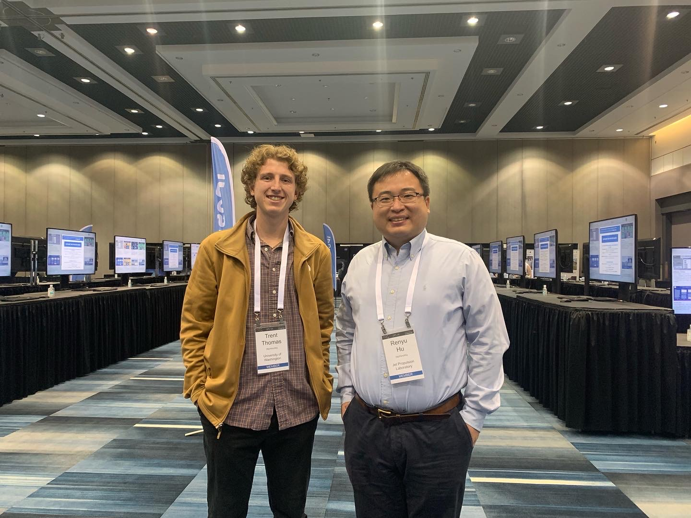

# Home
-------------------------

## About Me

Hi, my name is Trent Thomas. I am an astrobiologist and planetary scientist. 

I am an NSF Graduate Research Fellow pursuing a dual-title Ph.D. in Earth and Space Sciences and Astrobiology at the University of Washington, Seattle. I am also a researcher at NASA's Jet Propulsion Laboratory in Pasadena, California. A full list of my credentials can be found in my **[cv](assets/cvs/tthomas_cv.pdf)**.

My research is focused on how planets function in our solar system (e.g., Earth, Mars, Venus) and outside of our solar system (exoplanets). I use numerical modeling to simulate how planets evolve over time, which sheds light on the origin and evolution of life, and the search for life elsewhere. I am actively working on scientific research, publishing papers, and presenting at scientific conferences. More information on my research can be found in the **[research](research)** section.

I am based in Seattle, Washington.

To contact me, send me an email ([tbthomas@uw.edu](mailto:tbthomas@uw.edu)) or reach out on twitter ([@trentag0n](https://twitter.com/trentag0n)). I am happy to speak at events or engage in a wide range of outreach activities.

## What is Astrobiology?

Astrobiology is the study of the origin, evolution, and distribution of life in the universe. It has been a part of NASA since the 1960's (then called "exobiology") and is the driving force behind many space exploration missions, including the [Perseverance rover on Mars](https://astrobiology.nasa.gov/missions/2020-mars-rover/) and the [James Webb Space Telescope](https://astrobiology.nasa.gov/missions/jwst/).

Here are some helpful links to learn more about astrobiology:
* [NASA Astrobiology](https://astrobiology.nasa.gov/about/)
* [University of Washington Astrobiology](https://depts.washington.edu/astrobio/wordpress/about-us/what-is-astrobiology/)
* [National Geographic Astrobiology](https://www.nationalgeographic.com/astrobiology/)

------------------------- 

Me (left) and Dr. Renyu Hu (right) at the 54th American Astronomical Society Divison for Planetary Sciences Conference in October 2022.
